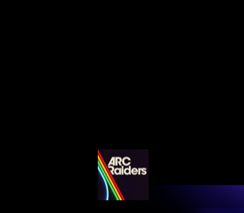

# Game Icon Fixer

A sleek, native GTK4 + Libadwaita Python application designed to fix grouping and display issues for game icons on the modern GNOME Wayland desktop.

It natively searches your `~/.local/share/applications` folder to resolve broken `StartupWMClass` configurations for:
- Steam (Automatic fixing available for all broken listings)
- Faugus Launcher (Manually update StartupWMClass for each game.)

## Before vs After

### GNOME Dock
<table>
<tr>
<td><b>Before</b></td>
<td><b>After</b></td>
</tr>
<tr>
<td></td>
<td></td>
</tr>
</table>

### Overview
<table>
<tr>
<td><b>Before</b></td>
<td><b>After</b></td>
</tr>
<tr>
<td></td>
<td></td>
</tr>
</table>

## Installation

### Arch Linux (AUR)

If you are using an AUR helper like **yay** or **paru**, you can install it instantly:
```bash
yay -S game-icon-fixer-git
# or
paru -S game-icon-fixer-git
```

Alternatively, to build and install it manually via the PKGBUILD:
```bash
git clone https://github.com/AdityaHebballe/Game-Icon-Fixer.git
cd Game-Icon-Fixer
makepkg -si
```

### Generic Install script (Ubuntu / Fedora / etc)

For other Linux distributions, you can safely use the provided shell install script. It installs the application perfectly into your local `~/.local/` user profile without requiring sudo.

```bash
git clone https://github.com/AdityaHebballe/Game-Icon-Fixer.git
cd Game-Icon-Fixer
chmod +x install.sh
./install.sh
```

**Note**: Ensure that `~/.local/bin` is in your `$PATH`.

To uninstall the application at any time:
```bash
./uninstall.sh
```

## Post-Installation
After installing, you can open your GNOME activities overview or app drawer and launch **Game Icon Fixer** alongside any other normal application!
